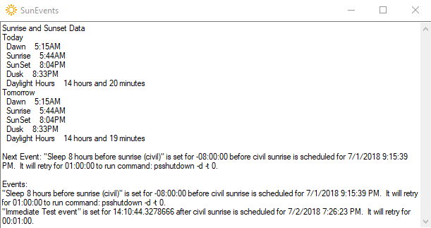

# SunEvents

SunEvents sits in the system tray and fires events at times relative to sunrise/sunset or dawn/dusk (aka civil sunrise, civil sunset).  The idea was to put my computer to sleep to prod me into going to sleep a reasonable amount of time before the sun would rise the next day.  I didn't get around to adding any interface to add or persist new events, but in the current state they could be added directly in code:

``` csharp
new SunEvent
{
    Name = "Sleep 8 hours before sunrise (civil)",
    IsSunrise = true,
    Offset = new TimeSpan(-8, 0, 0),
    Command = "psshutdown",
    CommandArgs = "-d -t 0",
    RetryPeriod = new TimeSpan(1, 0, 0),
    IsCivil = true
});
```

